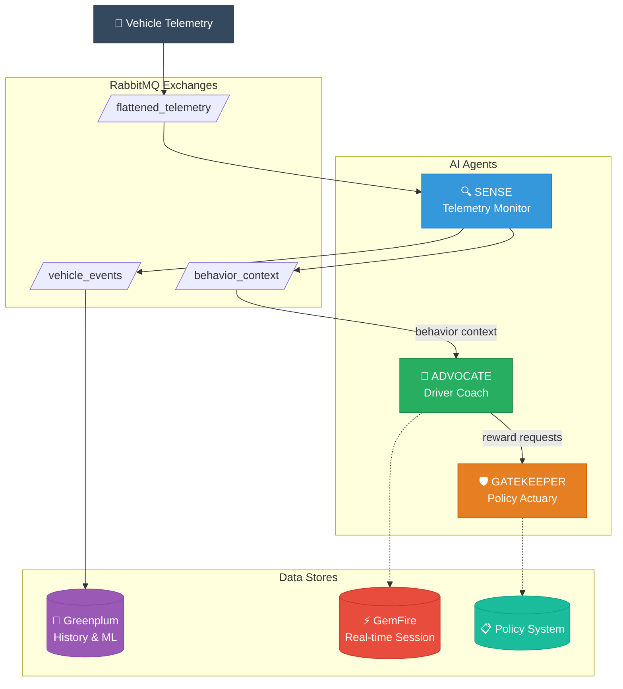

# Active Insurance Platform

A **Usage-Based Insurance (UBI)** platform demonstrating multi-agent AI collaboration on Cloud Foundry. The platform uses GenAI to actively coach drivers and dynamically adjust policy terms in real-time.

## Overview

Active Insurance showcases how AI agents can work together to provide personalized driver coaching while managing actuarial risk. Unlike simple rule engines, our agents understand complex context - distinguishing between "hard braking to avoid an obstacle" versus "aggressive tailgating" based on clustered telemetry data.

## Architecture



## The Agents

### 1. Sense (Telemetry Monitor)
**Status: Phase 1 Complete ✓**

The "eyes and ears" of the system. Ingests high-velocity telemetry streams and identifies micro-behaviors.

- Processes 35-field telemetry events from vehicles
- Detects 10 behavior types (harsh braking, speeding, cornering, etc.)
- Outputs to dual channels: Greenplum (for ML) and Coach Agent

📁 [sense/](./sense/) - [Documentation](./sense/README.md)

### 2. Advocate (Driver Coach)
**Status: Planned**

The user-facing personality that coaches drivers in real-time.

- Adopts personas matching driver profiles (Gentle Guide, Performance Instructor)
- Provides gamified feedback and rewards
- Negotiates with Gatekeeper for driver incentives

📁 [advocate/](./advocate/)

### 3. Gatekeeper (Policy & Actuary Agent)
**Status: Planned**

The financial risk manager with authority to modify policies.

- Evaluates reward requests against risk profiles
- Negotiates with Coach: *"Max $30 credit if score maintained 24 hours"*
- Updates backend policy system

📁 [gatekeeper/](./gatekeeper/)

## Technology Stack

| Component | Technology |
|-----------|------------|
| Framework | Spring Boot 3.5, Spring Modulith |
| AI/ML | Spring AI 1.1.2 (Phase 3) |
| Messaging | Spring Cloud Stream, RabbitMQ |
| Orchestration | Spring Cloud Dataflow |
| Data | Greenplum (history), GemFire (real-time) |
| Deployment | Cloud Foundry (TAS/Tanzu) |
| Build | Maven, Java 21 |

## Project Structure (Spring Modulith)

```
active-insurance/
├── pom.xml                    # Parent POM
├── README.md                  # This file
├── demo.md                    # Demo scenario details
│
├── sense/                     # Telemetry Monitor Module
│   ├── pom.xml
│   ├── README.md
│   ├── manifest.yml           # CF deployment
│   └── src/
│       └── main/java/com/insurancemegacorp/sense/
│           ├── model/         # Domain models
│           ├── processor/     # Stream processors
│           └── config/        # Configuration
│
├── advocate/                  # Driver Coach Module (planned)
│   └── ...
│
└── gatekeeper/               # Policy Agent Module (planned)
    └── ...
```

## Quick Start

### Prerequisites
- Java 21+
- Maven 3.9+
- Docker (for local RabbitMQ)
- Cloud Foundry CLI (for deployment)

### Build All Modules
```bash
./mvnw clean package
```

### Run Tests
```bash
./mvnw test
```

### Deploy to Cloud Foundry
```bash
# Deploy Sense module
cd sense
cf push -f manifest.yml
```

## The "Why AI?" Argument

*Why isn't this just a rule engine?*

1. **Complex Context:** A rule engine sees "Hard Brake." An AI Agent sees "Hard braking sequence consistent with avoiding an obstacle vs. aggressive tailgating" based on the cluster of data.

2. **The Negotiation:** The core "Agentic" workflow is the tension between the Coach (who wants to make the driver happy) and the Actuary (who wants to protect the company's risk). They must agree on a reward that satisfies both safety goals and financial margins.

## Simulated Driver Personas

| Persona | Behavior | Agent Response |
|---------|----------|----------------|
| Aggressive Commuter | High speed, sudden stops | Actuary raises risk; Coach warns |
| New Teen Driver | Erratic turns, low speed | Coach adopts teaching tone; Actuary locks rewards |
| Safe Pro | Smooth acceleration, anticipating stops | Coach requests Gold Status; Actuary approves deductible reduction |

## Development Roadmap

- [x] **Phase 1:** Core Sense processor with rule-based detection
- [ ] **Phase 2:** Windowed aggregation and session tracking
- [ ] **Phase 3:** Spring AI integration for pattern recognition
- [ ] **Phase 4:** Advocate (Coach) module implementation
- [ ] **Phase 5:** Gatekeeper (Actuary) module implementation
- [ ] **Phase 6:** Multi-agent negotiation workflow

## License

Proprietary - Insurance Megacorp

## Contributing

Internal project. See team lead for contribution guidelines.
