# Sense - Telemetry Monitor Agent

The **Sense** module is the "eyes and ears" of the Active Insurance platform. It ingests high-velocity telemetry streams from vehicles and identifies micro-behaviors in real-time using **pure rule-based detection**.

## Status: Complete ✓

Rule-based behavior detection with dual output routing and real-time dashboard.

## Overview

Sense replaces the legacy `imc-telemetry-processor` which only performed simple g-force threshold filtering. This new processor provides intelligent micro-behavior detection with context-aware risk scoring.

### Key Capabilities

- **35-field telemetry ingestion** - GPS, accelerometer, gyroscope, magnetometer, device state
- **10 behavior types detected** - From smooth driving to potential accidents
- **Dual output routing** - Vehicle events to Greenplum, behavior contexts to Coach Agent
- **Real-time risk scoring** - Weighted factors with confidence levels
- **Real-time WebSocket dashboard** - Monitor events, behaviors, and driver risk at `/dashboard`
- **Prometheus metrics** - Full observability for operations
- **No AI/LLM dependencies** - Pure deterministic rule-based processing

## Architecture

```mermaid
flowchart LR
    subgraph input["Input"]
        tel[/"📡 flattened_telemetry<br/>exchange<br/>(35 fields)"/]
    end

    subgraph processor["🔍 SENSE PROCESSOR"]
        direction TB
        detect["Behavior Detection"]
        risk["Risk Scoring"]
        coach["Coaching Triggers"]
        detect --> risk --> coach
    end

    subgraph output["Dual Output"]
        direction TB
        ve[/"🚗 vehicle_events<br/>exchange"/]
        bc[/"💬 behavior_context<br/>exchange"/]
    end

    subgraph destinations["Destinations"]
        direction TB
        gp[("🐘 Greenplum<br/>ML Pipeline")]
        ca["🤖 Coach Agent"]
    end

    tel --> processor
    processor --> ve
    processor --> bc
    ve --> gp
    bc --> ca

    style processor fill:#3498db,stroke:#2980b9,color:#fff
    style gp fill:#9b59b6,stroke:#8e44ad,color:#fff
    style ca fill:#27ae60,stroke:#1e8449,color:#fff
```



## Detected Behaviors

| Behavior | Description | Triggers Coaching | Records to DB |
|----------|-------------|-------------------|---------------|
| `HARSH_BRAKING` | G-force > 0.4g | ✓ | ✓ |
| `HARSH_ACCELERATION` | Aggressive acceleration | ✓ | |
| `AGGRESSIVE_CORNERING` | Lateral G > 0.3g | ✓ | ✓ |
| `SPEEDING` | Exceeds limit + 5mph tolerance | ✓ | |
| `DISTRACTED_DRIFTING` | Erratic lane position | ✓ | |
| `TAILGATING` | Insufficient following distance | ✓ | |
| `SMOOTH_DRIVING` | Exemplary behavior | | |
| `ERRATIC_PATTERN` | Inconsistent behavior | ✓ | |
| `COLLISION_AVOIDANCE` | Emergency evasive maneuver | | ✓ |
| `POTENTIAL_ACCIDENT` | G-force > 5.0g | | ✓ |

## Input: TelemetryEvent (35 Fields)

```java
// Core identifiers (5)
policyId, vehicleId, vin, driverId, eventTime

// Speed data (3)
speedMph, speedLimitMph, currentStreet

// Safety metrics (1)
gForce

// GPS data (8)
gpsLatitude, gpsLongitude, gpsAltitude, gpsSpeed,
gpsBearing, gpsAccuracy, gpsSatelliteCount, gpsFixTime

// IMU - Accelerometer (3)
accelerometerX, accelerometerY, accelerometerZ

// IMU - Gyroscope (3)
gyroscopeX, gyroscopeY, gyroscopeZ

// Magnetometer (4)
magnetometerX, magnetometerY, magnetometerZ, magnetometerHeading

// Environmental (1)
barometricPressure

// Device state (5)
deviceBatteryLevel, deviceSignalStrength, deviceOrientation,
deviceScreenOn, deviceCharging
```

## Output Models

### VehicleEvent (to Greenplum)

Sent for behaviors that `shouldRecordToDatabase()`:
- Potential accidents
- Collision avoidance maneuvers
- Harsh braking events
- Aggressive cornering

Used by the ML pipeline for pattern analysis and model training.

### BehaviorContext (to Coach Agent)

Rich context for every event including:
- Detected behaviors with confidence scores
- Risk assessment with weighted factors
- Coaching triggers (immediate vs end-of-trip)
- Trip context and processing metadata

## Configuration

```yaml
sense:
  detection:
    accident:
      g-force-threshold: 5.0      # G-force indicating potential accident
    harsh-braking:
      g-force-threshold: 0.4      # G-force for harsh braking
    speeding:
      tolerance-mph: 5            # MPH over limit before flagging
    cornering:
      lateral-g-threshold: 0.3    # Lateral G for aggressive cornering
```

## Metrics (Prometheus)

| Metric | Type | Description |
|--------|------|-------------|
| `sense_events_received_total` | Counter | Total telemetry events received |
| `sense_events_processed_total` | Counter | Successfully processed events |
| `sense_behaviors_detected_total` | Counter | Behaviors detected |
| `sense_vehicle_events_emitted_total` | Counter | Events sent to Greenplum |
| `sense_behavior_contexts_emitted_total` | Counter | Contexts sent to Coach |
| `sense_processing_duration_seconds` | Timer | Processing latency |

## Building

```bash
# From module directory
./mvnw clean package

# Run tests
./mvnw test
```

## Testing

The module includes comprehensive tests:

- **Unit tests** (`TelemetryProcessorTest`) - Processor logic validation
- **Integration tests** (`SenseProcessorIntegrationTest`) - Stream binding verification

Test utilities:
- `TestDataGenerator` - Creates telemetry events for all behavior types

```bash
# Run all tests
./mvnw test

# Run specific test class
./mvnw test -Dtest=TelemetryProcessorTest
```

## Deployment

### Cloud Foundry

```bash
cf push -f manifest.yml
```

### Spring Cloud Dataflow

Register as a processor application:

```bash
app register --name sense --type processor \
  --uri maven://com.insurancemegacorp:sense-processor:1.0.0-SNAPSHOT
```

Stream definition:

```
telemetry-source | sense | vehicle-events-sink
                        \ behavior-context-sink
```

## Project Structure

```
sense/
├── pom.xml
├── manifest.yml                  # Cloud Foundry deployment
├── README.md                     # This file
└── src/
    ├── main/
    │   ├── java/com/insurancemegacorp/sense/
    │   │   ├── SenseApplication.java
    │   │   ├── config/
    │   │   │   ├── StreamConfig.java
    │   │   │   └── HealthConfig.java
    │   │   ├── model/
    │   │   │   ├── TelemetryEvent.java      # 35-field input
    │   │   │   ├── VehicleEvent.java        # Greenplum output
    │   │   │   ├── BehaviorContext.java     # Coach Agent output
    │   │   │   ├── MicroBehavior.java       # 10 behavior types
    │   │   │   └── RiskLevel.java           # Risk classification
    │   │   └── processor/
    │   │       └── TelemetryProcessor.java  # Main processor
    │   └── resources/
    │       └── application.yml
    └── test/
        └── java/com/insurancemegacorp/sense/
            ├── TestDataGenerator.java
            ├── TelemetryProcessorTest.java
            └── SenseProcessorIntegrationTest.java
```

## Dashboard

Access the real-time monitoring dashboard at `http://localhost:8081/dashboard`

Features:
- Events per second throughput
- Total events and behaviors detected
- Active driver count
- Potential accidents counter
- Behavior breakdown (harsh braking, speeding, cornering)
- Recent events feed with risk scores
- Top risk drivers leaderboard

The dashboard uses WebSocket for live updates without polling.

## Design Philosophy

Sense uses **pure rule-based detection** rather than AI/ML for behavior classification. This approach was chosen because:

1. **Deterministic results** - Same input always produces same output
2. **Explainable decisions** - Every classification has clear, auditable rules
3. **No context hallucination** - Single-point telemetry lacks the context needed for AI to infer driver intent
4. **Fast processing** - No API latency or token costs
5. **Offline capable** - Works without external service dependencies

The thresholds are configurable and based on industry standards for driving behavior analysis.

## Roadmap

- [x] **Phase 1:** Rule-based behavior detection
- [x] **Phase 2:** Real-time WebSocket dashboard
- [ ] **Phase 3:** Windowed aggregation and session tracking

## Related Modules

- **Advocate** (planned) - Driver coaching agent that consumes BehaviorContext
- **Gatekeeper** (planned) - Policy and actuary agent for risk management
